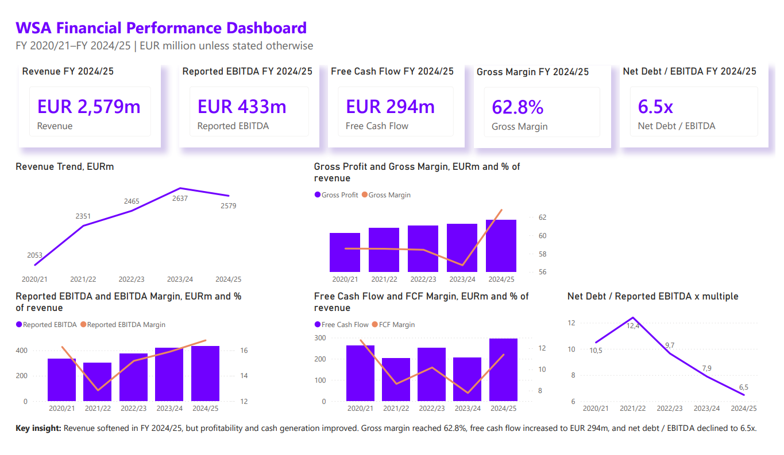

# WSA Financial Performance Dashboard

Financial statement analysis and Power BI dashboard for WS Audiology using publicly available annual report data.

## Project Overview

This project analyzes WS Audiology's financial performance from FY 2020/21 to FY 2024/25. The analysis focuses on revenue development, profitability, free cash flow generation, and leverage.

The project includes an Excel-based financial model and a Power BI dashboard designed to summarize the key financial trends in a clear and business-oriented format.

## Tools Used

- Microsoft Excel
- Power BI
- DAX
- Financial statement analysis
- Ratio analysis
- Data visualization

## Files in This Repository

| File | Description |
|---|---|
| `WSA_Financial_Statement_Analysis_Model.xlsx` | Excel model with raw financial data, ratio calculations, chart data, dashboard mockup, and methodology |
| `WSA_Financial_Performance_Dashboard.pbix` | Power BI dashboard file |
| `WSA_PowerBI_Data.xlsx` | Clean long-format dataset used for Power BI |
| `dashboard_screenshot.png` | Screenshot of the final Power BI dashboard |

## Key Metrics Analyzed

- Revenue
- Gross profit and gross margin
- Reported EBITDA and EBITDA margin
- Free cash flow and FCF margin
- Net interest-bearing debt
- Net debt / reported EBITDA

## Key Insights

- Revenue increased from EUR 2,053m in FY 2020/21 to EUR 2,637m in FY 2023/24, before declining slightly to EUR 2,579m in FY 2024/25.
- Gross margin improved to 62.8% in FY 2024/25.
- Reported EBITDA increased to EUR 433m in FY 2024/25.
- Free cash flow increased to EUR 294m in FY 2024/25.
- Net debt / reported EBITDA declined to 6.5x, indicating an improved leverage profile compared with earlier years.

## Methodology

The analysis is based on selected five-year key financial figures from WS Audiology's public annual reports. The Excel model structures the raw financial data, calculates key ratios, and prepares the dataset for Power BI.

The Power BI dashboard visualizes the main financial trends and highlights the relationship between absolute financial performance and margin-based indicators.

## Data Source

Data is based on publicly available WS Audiology annual reports, especially the FY 2024/25 annual report and its restated five-year key figures table.

Source: WS Audiology Investor Relations / Annual Reports.

## Limitations

This project is a dashboard-level financial analysis, not a full three-statement financial model. Balance sheet and cash flow analysis are based on selected key metrics relevant for profitability, cash generation, and leverage analysis.

## Author

Created by Namig Farzaliyev as a finance analytics and dashboarding portfolio project.
